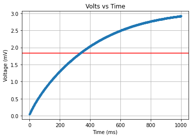

# Cal Poly ME-405
## Lab 04
Jacob Bograd, Nick De Simone, Horacio Albarran

Documentation: https://github.com/ME-405/Lab_4

---

This lab conceptualize the way in which interrupts functions while using Queues with an Analog to Digital converter.
A time interrupt has been used in order to analyze the signal provided by such interruption while using a simple RC circuit.
Regarding the RC circuit display below, a capacitor of 4.75 uF was used as well as a 5.95 Kohms and 104 Kohms resistors
 

---
Graphs  
  
This graphs shows the signal for a 16-bits integers, with a 1000 size queue, and input voltage signal of 3.3 Volts   
  
This graphs shows the signal for a 16-bits integers, with a 1000 size queue, and input voltage signal of 3.3 Volts  
  
This graphs shows the signal for a 16-bits integers, with a 2000 size queue, and input voltage signal of 3.3 Volts  
