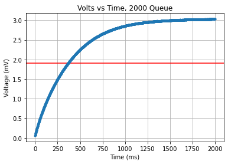

# Cal Poly ME-405
## Lab 04
Jacob Bograd, Nick De Simone, Horacio Albarran

Documentation: https://me-405.github.io/Lab_4/

---

This lab conceptualize the way in which interrupts functions while using Queues with an Analog to Digital converter.
A time interrupt has been used in order to analyze the signal provided by such interruption while using a simple RC circuit.
Regarding the RC circuit display below, a capacitor of 4.75-uF was used as well as a 5.95-Kohms and 104-Kohms resistors; further,
the theoretical time constant for the RC circuit was calculated to be around 522-ms
 

---
Graphs  
  
This graphs shows the signal for a 16-bits integers, with a 1000 size queue, and voltage signal of 3.3 Volts.
The experimental time constant for this trial was calculated to be 340-ms and yielded a numerical percent error of 34.87
  
This graphs shows the signal for a 16-bits integers, with a 1000 size queue, and input voltage signal of 3.3 Volts.  
The experimental time constant for this trial was calculated to be 340-ms and yielded a numerical percent error of 34.87 
  
This graphs shows the signal for a 16-bits integers, with a 2000 size queue, and input voltage signal of 3.3 Volts.
The experimental time constant for this trial was calculated to be 375-ms and yielded a numerical percent error of 28.16  

**Note**
The horizontal read line on each image represents the location of the voltage where the numerical value of the time constant occurs
